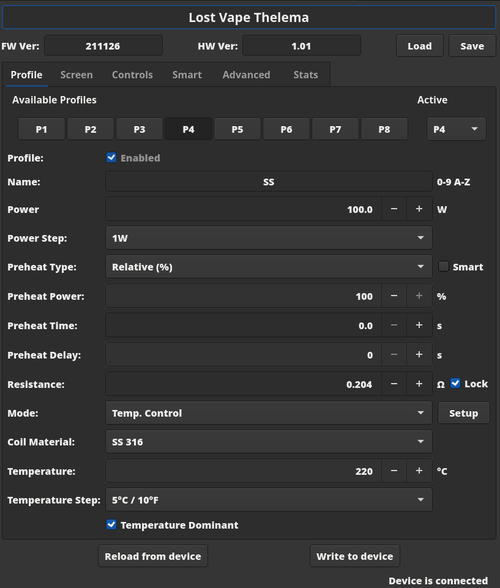

# NFE (ArcticFox Configuration)



This is an **UNOFFICIAL** configuration utility for devices running the ArtixFox Firmware, especially the STM32 branch.
Please see the official forum here:
https://nfeteam.org/forum
and the STM32 thread:
https://nfeteam.org/forum/threads/lost-vape-quest-chip-grus-ursa-cyborg-btb-thelema.4905

# Audience
I wrote this for myself and I use Linux exclussively. It only needs Qt5 and hidapi, both available for Windows/Apple too, should be portable.

# Warning
The official tools know things about firmare versions and device models and capabilities and stuff. This tool doesn't.
Even though it probably won't brick your device, I don't recommand using it on other devices than STM32.

# Installation
You'll have to build this yourselves.
Besides, you have to give yourselves permission to access the USB device ("hidraw").
Create the file `/etc/udev/rules.d/99-af.rules` and paste this to it:
```
KERNEL=="hidraw*", MODE="0666", TAG+="uucp", TAG+="udev-acl", TAG+="uaccess"
```

## Prerequisites
### Arch and derivates
- base-devel
- qt5-base
- qt5charts
- hidapi

### Ubuntu and derivates (tested on Linux Mint 20.2 "Uma")
- build-essential
- qt5-default
- libqt5charts5-dev
- libhidapi-dev

## Build
Clone this repo and `cd` to it. Then:
```
mkdir build && cd build
cmake ..
make -j
```
That's it. You should have the `nfe` executable, which you can put anywhere.

## Copyright
I got the logo picture from here: https://github.com/TBXin/NFirmwareEditor/blob/master/src/NToolbox/Resources/arcticfox_logo.png